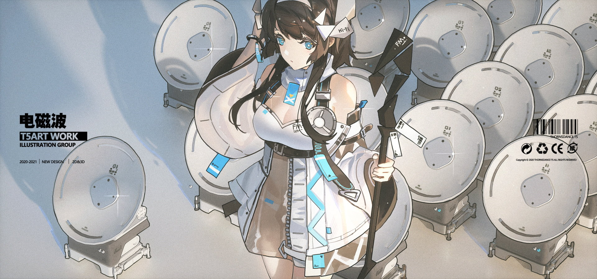
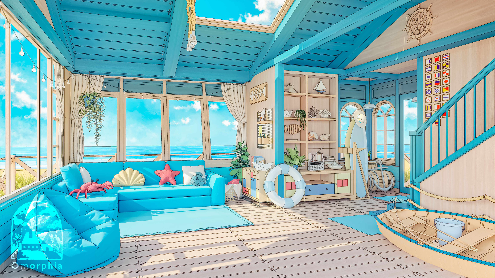
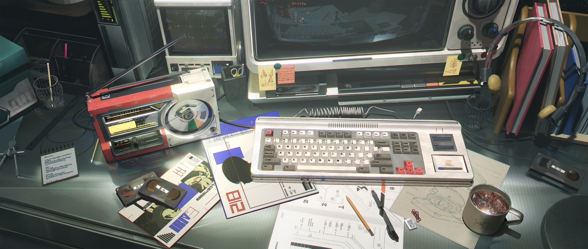
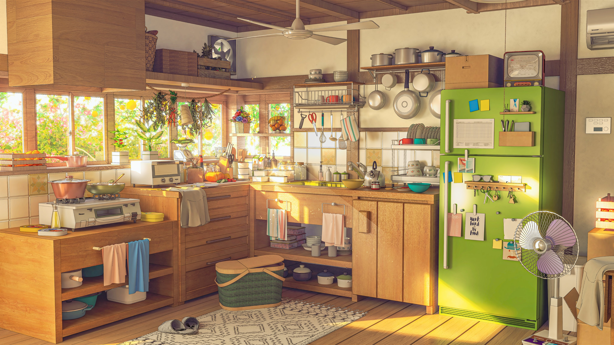

# Wallpapers

<table>
  <tr>
    <td align="center"> W1</td>
    <td align="center"> W2</td>
    <td align="center"> W3</td>
    <td align="center"> W4</td>
    <td align="center"> W5</td>
  </tr>
  <tr>
    <td align="center"> W6</td>
    <td align="center"> W7</td>
    <td align="center"> W8</td>
    <td align="center"> W9</td>
    <td align="center"> W10</td>
  </tr>
  <tr>
    <td align="center"> W11</td>
    <td align="center"> W12</td>
    <td align="center"> W13</td>
    <td align="center"> W14</td>
    <td align="center"> W15</td>
  </tr>
  <tr>
    <td align="center"> W16</td>
    <td align="center"> W17</td>
    <td align="center"> W18</td>
    <td align="center"> W19</td>
    <td align="center"> W20</td>
  </tr>
  <tr>
    <td align="center"> W21</td>
    <td align="center"> W22</td>
    <td align="center"> W23</td>
    <td align="center"> W24</td>
    <td align="center"> W25</td>
  </tr>
  <tr>
    <td align="center"> W26</td>
    <td align="center"> W27</td>
    <td align="center"> W28</td>
    <td align="center"> W29</td>
    <td align="center"> W30</td>
  </tr>
  <tr>
    <td align="center"> W31</td>
    <td align="center"> W32</td>
    <td align="center"> W33</td>
    <td align="center"> W34</td>
    <td align="center"> W35</td>
  </tr>
  <tr>
    <td align="center"> W36</td>
    <td align="center"> W37</td>
    <td align="center"> W38</td>
    <td align="center"> W39</td>
    <td align="center"> W40</td>
  </tr>
  <tr>
    <td align="center"> W41</td>
    <td align="center"> W42</td>
    <td align="center"> W43</td>
    <td align="center"> W44</td>
    <td align="center"> W45</td>
  </tr>
  <tr>
    <td align="center"> W46</td>
    <td align="center"> W47</td>
    <td align="center"> W48</td>
    <td align="center"> W49</td>
    <td align="center"> W50</td>
  </tr>
  <tr>
    <td align="center"> W46</td>
    <td align="center"> W47</td>
    <td align="center"> W48</td>
    <td align="center"> W49</td>
    <td align="center"> W50</td>
  </tr>
</table>
